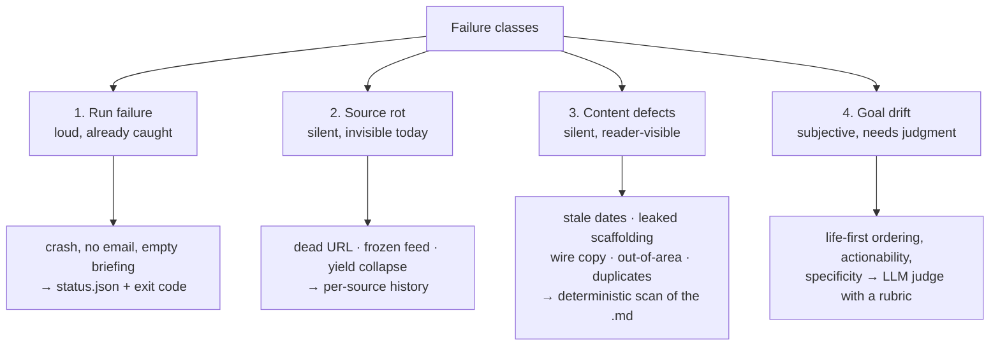
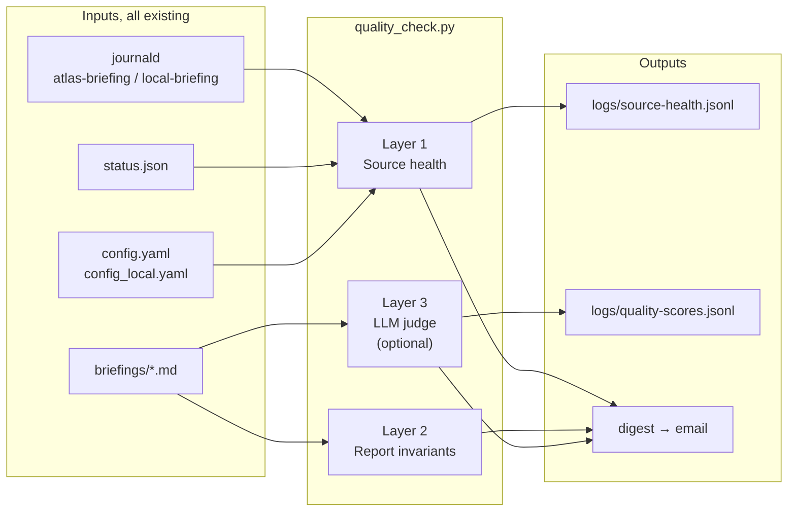

# Daily Quality Check — Design Proposal

**Status:** built and verified 2026-08-25; see "What shipped" at the end
**Date:** 2026-08-25
**Context:** written after a manual quality review of the Aug 22 / 24 / 25 runs on `feat/geo-aware-local-briefing`

---

## Why this is worth building

A manual review of three production runs found four content defects and one whole class of silent rot. Every one of them shipped to the reader's Kindle, and none of them tripped an error — `status.json` reported `errors: []` on all three days.

| What was wrong | How long it ran | What the pipeline reported |
|---|---|---|
| Happenings advertised a weekend that had already ended | 3+ runs | no error |
| Model's filtering rationale rendered into a summary | 1 run | no error |
| Pay-to-publish press release ran as neighborhood news | 1 run | no error |
| 11 of 41 blog feeds contributed nothing for 23 consecutive runs | ~1 month | no error |

The last row is the one that matters most for the "what if a source goes dark" question, so here is the actual measurement, harvested from journald across Aug 1–25:

| Feed | Runs | Runs with ≥1 item | Items all month | Live probe |
|---|---:|---:|---:|---|
| Anthropic | 23 | 0 | 0 | **404 — dead URL** |
| Meta AI | 23 | 0 | 0 | **404 — dead URL** |
| MIT News AI | 23 | 0 | 0 | **404 — dead URL** |
| Google AI Blog | 23 | 0 | 0 | 200, newest entry **2024-03-29** |
| Chip Huyen | 23 | 0 | 0 | 200, newest entry 2025-01-16 |
| The Gradient | 23 | 0 | 0 | 200, newest entry 2026-02-18 |
| Karpathy | 23 | 0 | 0 | 200, newest entry 2026-02-12 |
| BAIR, Benedict Evans, Eugene Yan, Lilian Weng | 23 | 0 | 0 | 200, alive, genuinely infrequent |
| VentureBeat AI | 23 | 3 | 3 | 200, publishes constantly — under-yielding |
| Sebastian Raschka | 23 | 4 | 4 | 200, published 3 days ago — under-yielding |

Three feeds are **outright dead** and have been for at least a month. One has been **frozen since March 2024** and still returns HTTP 200, which is why nothing ever complained. Two publish regularly but barely register.

That is roughly a quarter of the Atlas briefing's source base quietly contributing nothing, and the only reason it surfaced is that someone went looking by hand.

---

## The four failure classes

Any check worth running has to be built around what actually goes wrong, not around what is easy to assert.



**Class 1 is handled.** The runner writes `status.json`, appends to `errors`, and returns a nonzero exit code. Cron catches the rest.

**Class 2 is completely invisible today.** A feed returning zero items looks identical to a feed that simply had a quiet day. The distinction can only be made against that source's own history.

**Class 3 is mechanically detectable** — every defect found this week is a regex or a date comparison away from being caught automatically.

**Class 4 needs a model**, because "did this lead with what changes for the reader" is a judgment, not an assertion.

---

## Design principles

These come directly out of how the manual review actually worked.

1. **Deterministic first, LLM last.** Every defect found this week except tier-ordering was catchable without a model. The LLM judge is the smallest, last, and most optional layer — not the centerpiece.
2. **Harvest logs; don't instrument the pipeline.** The runner already logs `Found N articles from <feed>` and `Found N articles for query: <q>` at INFO. `scripts/brave_usage_report.py` already establishes the pattern of parsing journald with a regex. No pipeline changes are needed to get per-source yield — it is sitting in the journal right now.
3. **Alert on deviation from a source's own history, never on an absolute.** Lilian Weng publishing nothing for a month is normal. VentureBeat publishing nothing for a month is broken. The same zero means different things, and only history separates them.
4. **A quiet source is not a broken source.** The cost of a false alarm is that the next real alarm gets ignored. Thresholds should be tuned so a normal week is silent.
5. **The checker degrades gracefully.** Same hard rule the pipeline follows (`GEMINI.md`): if the LLM is unavailable, the deterministic layers still run and still report.
6. **The checker is read-only.** It never writes `.atlas-state.json`, never re-runs delivery, never mutates a briefing. Its only writes are its own history and digest files.
7. **One finding, one line, one severity.** The digest has to be skimmable in 15 seconds on a phone, or it will not be read.

---

## Architecture



One script, three layers, run once after both briefings finish. Layers are independently skippable so a failure in one never suppresses the others.

---

## Layer 1 — Source health

The core of the "what if a source goes dark" question. Three distinct failure modes, each needing its own rule, because they present identically as "zero items".

### Mode A — Dead URL

The feed returns 404, a redirect to HTML, or fails to parse.

- **Detection:** HTTP status ≠ 200, or `Content-Type` is HTML, or feedparser yields zero entries.
- **Signal available today:** the runner already logs `Feed parsing issue for <name>` — Anthropic, DeepMind, Meta AI, MIT News AI, and VentureBeat all logged one on Aug 25 and nobody was told.
- **Severity:** WARN on first sighting, CRITICAL after 3 consecutive runs.
- **Real example:** `Anthropic` → 404. Dead all month.

### Mode B — Frozen feed

The feed is healthy, parses fine, and hasn't published in months. This is the sneaky one — it never errors.

- **Detection:** newest entry's publish date is older than a per-feed threshold (default 90 days; overridable for known-slow bloggers).
- **Severity:** WARN, with the newest entry's date in the message so the call is obvious.
- **Real example:** `Google AI Blog` → HTTP 200, newest entry **2024-03-29**. Alive, abandoned, still in the config.

### Mode C — Yield collapse

The feed is alive and publishing but stopped reaching the briefing — a recency-window mismatch, a parse quirk, a category feed that changed shape.

- **Detection:** zero items for K consecutive runs (default 7) **when the trailing 30-run median for that feed was ≥ 1**. The history condition is what prevents false alarms on genuinely quiet sources.
- **Severity:** WARN.
- **Real examples:** `VentureBeat AI` (3 yield-runs out of 23 despite constant publishing) and `Sebastian Raschka` (published 3 days ago, 4 yield-runs out of 23).

### Brave query health

Same logic on the news side, using `Found N articles for query: <q>`.

- Zero-result queries are pure quota burn. This session found four condition-style queries returning 15 out-of-area results each, and removing them was worth more than adding any new one.
- **Rule:** a query whose trailing 14-run mean yield is < 1 gets flagged as dead weight, with its monthly API cost attached.
- **Weekly deep probe:** re-run every configured query once and record yield — the same audit done by hand this session, automated. ~35 calls/week against a ~1,000/month budget, so run it Sundays, not daily.
- **Quota watch:** `brave_usage_report.py` already computes rolling usage. Alert at 80% of the monthly budget.

### NWS zone health

- Alerts are the only section with no LLM in the path, so its failure mode is a bad zone code, not bad content.
- **Rule:** an HTTP failure is WARN; **zero alerts is not an alert** — no active warnings is the normal, correct state most days.
- Sanity check monthly: confirm each configured zone still resolves via `api.weather.gov/zones/forecast/<id>`.

### `logs/source-health.jsonl`

One record per source per run, appended:

```json
{
  "ts": "2026-08-25T06:15:23-07:00",
  "pipeline": "local",
  "kind": "feed",
  "name": "Times of San Diego Events",
  "yield": 0,
  "hard_error": null,
  "newest_entry": "2026-08-19T11:02:00-07:00"
}
```

`kind` is one of `feed`, `query`, `alerts_zone`. Layers read the trailing window from this file rather than re-parsing a month of journald every morning — journald is the bootstrap source and the fallback, the JSONL is the working history.

---

## Layer 2 — Report invariants

A deterministic scan of the generated markdown. Every rule below corresponds to a defect that actually shipped.

| # | Check | Rule | Severity | Caught this week? |
|---|---|---|---|---|
| 1 | Section presence | every section in `section_order` with data renders a heading | CRITICAL | — |
| 2 | Section order | headings appear in configured order | WARN | — |
| 3 | Empty briefing | any section renders zero items when its input was non-empty | CRITICAL | — |
| 4 | **Past-dated events** | any explicit date in the happenings section that is before today | **CRITICAL** | ✅ "Aug. 21-23" served Aug 25 |
| 5 | **Scaffolding leak** | `Dropped:` / `Excluded:` / `Omitted:` / verification-step patterns in rendered copy | **CRITICAL** | ✅ leaked rationale |
| 6 | **Blocked source** | any item whose host is in `geo_filter.blocked_sources` | WARN | ✅ openpr.com |
| 7 | Out-of-area | any item with no `place_terms` match and no trusted source | WARN | — |
| 8 | Near-duplicates | two items with headline Jaccard ≥ 0.3 | WARN | — |
| 9 | Placeholder text | `your-email@`, `YOUR_NAME`, `example.com` in output | WARN | — |
| 10 | Thin section | item count below a per-section floor | INFO | ✅ news rendered 2 of 5 |
| 11 | Delivery | `email_sent: true` and the artifact exists on disk | CRITICAL | — |

Checks 4, 5, 6 and 8 are re-assertions of guarantees now enforced in code. That is intentional: the code fix prevents the defect, the check proves the fix is still working, and a prompt change six months from now that quietly reintroduces it gets caught the next morning.

---

## Layer 3 — LLM judge

The only layer that needs a model, scoring the qualitative goals this branch was built around. Runs once per briefing on the rendered markdown, medium tier.

**Rubric** — each dimension scored 0–2 with a one-line justification:

| Dimension | 2 | 0 |
|---|---|---|
| Tier-1 share | most items are daily-life/neighborhood | dominated by policy and market items |
| Lead alignment | executive summary opens on what changes for the reader | opens on a development or investment story |
| Actionability | items carry a date, place, cost, or decision | analysis with no handle for action |
| Locality | everything is in or about the area | contains items from elsewhere |
| Specificity | names, numbers, streets | generic "X is important for Y" filler |
| Freshness | nothing already past | advertises expired events |

**Output** to `logs/quality-scores.jsonl`, one record per briefing, so the score can be trended across weeks — which is exactly how the Aug 22 / 24 / 25 comparison exposed the stale-happenings pattern in the first place. A single day's score is noise; the trend is the signal.

**Guardrails:**
- Runs against the *rendered* markdown only — no re-fetching, no re-ranking, no cost beyond one call.
- If the LLM chain is unavailable, Layers 1 and 2 still run and the digest says the judge was skipped.
- The judge never blocks or edits a briefing. It reports.
- Its own prompt gets the same `_sanitize_prompt_input` treatment — the briefing contains third-party headline text.
- Alert only on a **3-run trailing drop** in a dimension, not on a single low score. Model scoring is noisy; three consecutive days is a trend.

---

## Alerting policy

The digest is only useful if a quiet day is genuinely quiet.

| Severity | Meaning | Channel |
|---|---|---|
| CRITICAL | reader got a broken or wrong briefing, or got none | email immediately |
| WARN | a source or check degraded; briefing still shipped | daily digest |
| INFO | worth knowing, no action | weekly roll-up only |

Both paths reuse `email_distributor.py`, which already handles markdown-to-HTML rendering, sanitization, and address masking in logs — the same mechanism that delivers the briefing itself. One delivery path to keep working, not two. (`scripts/send_briefing_telegram.py` exists in the repo but is dead weight from an earlier machine and is not used.)

**Deduplicate alerts.** A dead feed should page once, then appear in the digest as a standing item until fixed — not page every morning for a month. Track `first_seen` / `last_alerted` per finding in the health JSONL.

---

## Fix these first

Two prerequisites, both discovered while working out where the data would come from.

**1. `status.json` is shared and gets clobbered.** `save_status()` writes a hardcoded `status.json` in the output dir. `run_briefing.sh` runs Atlas at 06:00 and Local at ~06:15, so the Local run overwrites the Atlas run's status eight minutes later. The Atlas run's counters are unrecoverable — today's `status.json` shows `papers_found: 0` and `alerts_found: 1`, which is the *local* run. Any monitoring built on `status.json` is reading one pipeline and calling it both.

*Fix:* add a `status_file_path` config key, defaulting to `status.json` for backward compatibility; set `status-local.json` in `config_local.yaml`.

**2. Per-source yield is only in free text.** The log lines exist and are parseable, but they are prose. A `logger.info` with a structured suffix — or a small JSONL written by the scanners — would make Layer 1 robust against a log-format change. Optional: the regex approach works today and matches the existing `brave_usage_report.py` precedent.

---

## Build plan

**Phase 0 — prerequisites** (~1 hour)
Per-pipeline status file. Add `references/` note. No behavior change.

**Phase 1 — source health** (highest value; ships the answer to the original question)
`scripts/source_health.py` — journald harvester → `logs/source-health.jsonl`, Modes A/B/C detection, `--probe` for live URL checks, `--report` for markdown out. Backfill history from journald on first run. Tests with synthetic log fixtures.

**Phase 2 — report invariants**
`scripts/quality_check.py` Layer 2 — pure functions over a markdown string, trivially testable. Feed it the three briefings from this week as fixtures; checks 4, 5 and 6 must fire on the Aug 25 local briefing and stay silent on the Aug 25 Atlas one.

**Phase 3 — digest + alerting**
Severity routing, dedupe, email for CRITICAL, daily markdown digest. Cron:

```cron
# after both briefings finish (Atlas ~06:15, Local ~06:24)
40 6 * * 1-6 /home/eric/atlas-morning-briefing/run_quality_check.sh
# weekly deep probe: query yields, feed liveness, zone sanity, quota
15 7 * * 0  /home/eric/atlas-morning-briefing/run_quality_check.sh --deep
```

**Phase 4 — LLM judge**
Rubric call + `logs/quality-scores.jsonl` + trailing-window trend alerts.

Phases 1 and 2 deliver most of the value and need no model at all. Phase 4 is the one to defer if attention runs short.

---

## Decisions I need from you

1. **Dead feeds — repair or remove?** Anthropic, Meta AI and MIT News AI need new URLs; Google AI Blog has been frozen since 2024 and probably wants deleting. Want me to fix those now, separately from building any of this?
2. **Per-feed staleness thresholds.** A flat 90 days will nag about Lilian Weng and Benedict Evans forever. Worth a `stale_after_days` override per feed in config, or accept the noise on a handful?
3. ~~**Alert channel.**~~ **Resolved:** email, through the briefing's own Gmail
   path. Telegram is not used; there is now one delivery mechanism, not two.
4. **Where the judge runs.** A plain script reusing the existing composite LLM client is simplest and needs no new auth. The alternative is a scheduled Claude Code routine, which is more capable but adds a moving part outside the repo.

---

## Appendix — how this session's review was actually done

The build plan above is essentially this sequence, automated:

1. `git log` / branch state → confirm which code actually ran in production.
2. `status.json` → counters and error list for the last run.
3. `journalctl -t atlas-briefing -t local-briefing` → per-stage diagnostics, per-source yields, warnings.
4. Read the rendered `.md` → structure, ordering, staleness, leaks, source quality.
5. Compare across days → spot patterns invisible in a single run.
6. Live-probe the sources → separate "broken" from "quiet".
7. Replay real cached input through the changed code → verify the fix on the actual failing case.

Steps 2–6 are mechanical and belong in a script. Step 7 is the one that stays manual, and it is the one worth keeping manual.

---

## What shipped

Built the same day the proposal was written. Phases 0-4 are all in place.

| Piece | File | Tests |
|---|---|---|
| Shared finding vocabulary | `scripts/quality_findings.py` | — |
| Shared headline similarity | `scripts/text_similarity.py` | — |
| Layer 1, source health | `scripts/source_health.py` | 49 |
| Layer 2, report invariants | `scripts/report_invariants.py` | 42 |
| Orchestrator, judge, digest, alerts | `scripts/quality_check.py` | 58 |
| Per-pipeline status files | `scripts/briefing_runner.py` | 4 |
| Cron wrapper | `run_quality_check.sh` | — |

Suite: 1007 passed, 3 skipped.

### First real run, against the Aug 25 briefings

Exit code 1, as designed, because real CRITICALs were present:

- `scaffolding-leak` — the leaked `Dropped: [1], [2], [7]…` rationale, caught verbatim
- `stale-event` x2 — the Aug 21 and Aug 23 dates advertised in an Aug 25 briefing
- `blocked-source` — the openpr.com press release
- Atlas briefing: **zero findings**, confirming the checks discriminate rather than just fire

The judge, reading only the rendered markdown, scored the local briefing 8/12 and
returned `lead_alignment: 0` — *"opens on the Midway Rising Sports Arena
redevelopment, a development/investment story, not what changes for the reader
today"*. That is the same criticism the manual review reached independently,
which is the best evidence available that the rubric encodes the actual goals.

### Deviations from the proposal above

- **The dead-URL rule needed a yield condition.** Counting any run with a
  `hard_error` flagged DeepMind CRITICAL every morning: it logs a cosmetic
  encoding warning while delivering content in 8 of 23 runs. A run now counts
  toward the streak only when it errored *and* returned nothing.
- **The judge rubric is per-pipeline.** Scoring Atlas on `tier_1_share` and
  `locality` produced a permanent, meaningless `5/12`. Dimensions are now config
  driven; Atlas scores 4 dimensions, the local briefing all 6.
- **Feed staleness needed per-feed overrides.** A flat 90 days nags forever about
  writers who post quarterly. `feed_overrides` exempts them by name.

All three are the same lesson: a check that cries wolf on a healthy system is
worse than no check, because the first thing it teaches is to stop reading.

### Scheduled

**Chained, not clock-scheduled.** The audit runs at the end of
`run_briefing.sh`, right after both briefings finish.

The first version used a fixed `40 6 * * 1-6`, chosen because the briefings had
finished by 06:25 the day before. The next morning the Atlas run took 32 minutes
instead of 15 — an LLM backend was failing and every call burned its retries —
so the local briefing was still being written at 06:41 while the checker
inspected the directory at 06:40 and reported `briefing-missing` CRITICAL. The
briefing was fine; the schedule was wrong. Run length is a function of backend
health, so no fixed time is safe.

The weekly `--deep` probe rides along on Saturday rather than Sunday, because
briefings run Mon-Sat and a Sunday audit would find no briefing to audit.

One late backstop remains in cron for the case where `run_briefing.sh` dies
before reaching the audit. The 24h alert dedupe means a duplicate run does not
re-send:

```cron
30 8 * * 1-6 /home/eric/atlas-morning-briefing/run_quality_check.sh
```

The wrapper pipes everything to journald under the `quality-check` tag, so a
morning's digest is readable with:

```bash
journalctl -t quality-check --since today -o cat
```

Exit-code contract, verified end to end before scheduling: `0` on a clean
briefing, `1` when a CRITICAL is present, `1` when a briefing is missing
entirely, `2` if the checker itself fails. Cron mails on nonzero.

### Not yet done

- Nothing outstanding on delivery: CRITICAL findings email out through the
  briefing's own Gmail path, using the credentials already in `.env`.
